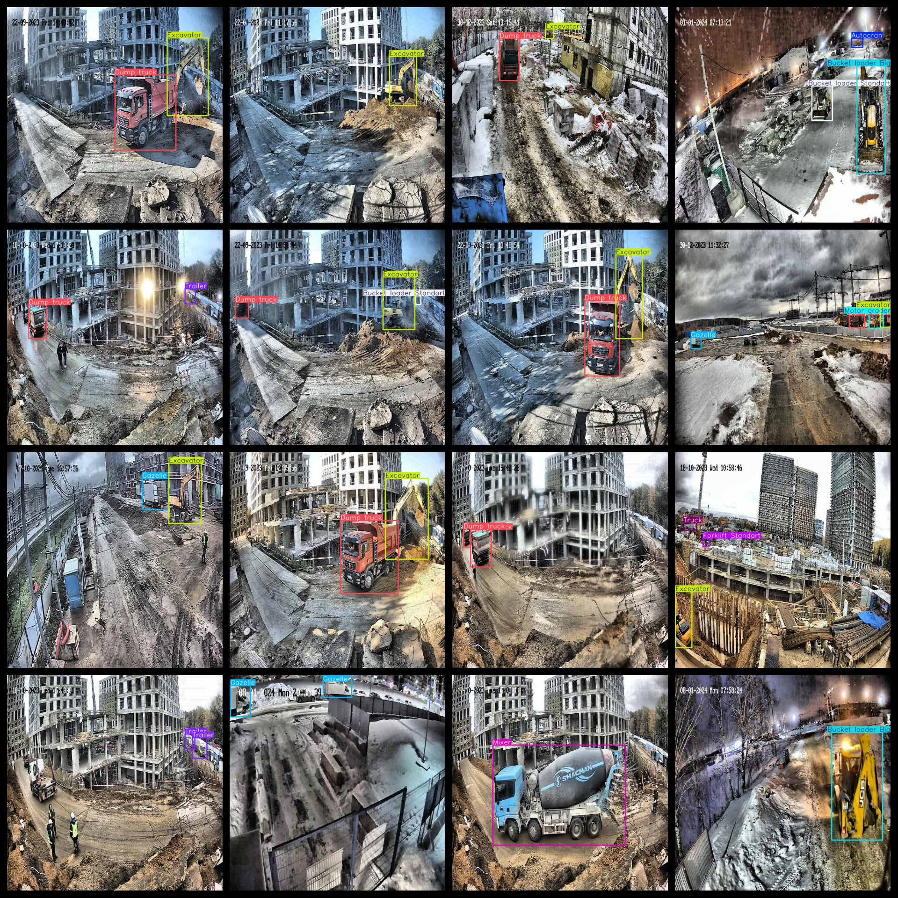
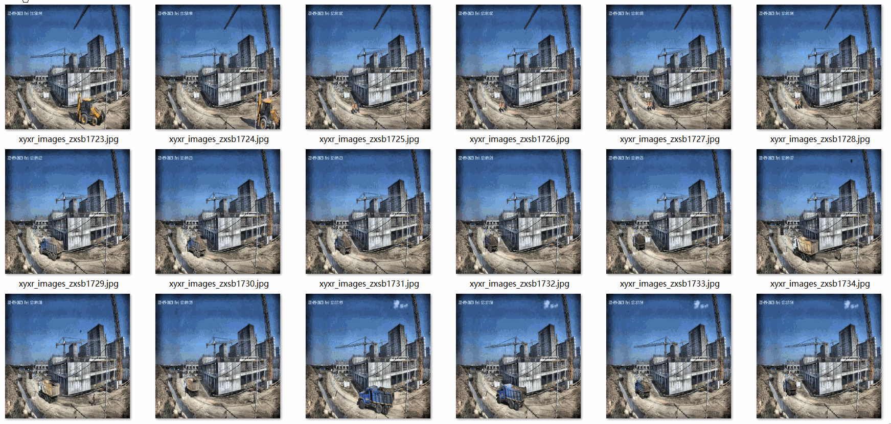

# Building Construction Site Scene Heavy Vehicle Detection Dataset 16985 imagesVOC+YOLO

Building Construction Site Scene Heavy Vehicle Detection Dataset 16985stretchVOC+YOLO

Dataset format: Pascal VOC format + YOLO format (the txt file does not contain the split path, it only contains jpg images and corresponding VOC format xml files and yolo format txt files)

Number of images: 16985

Number of xml files: 16985

Number of annotations (number of txt files): 16985

Number of categories: 17

The Github repository is: datasets_sl

["Autocran","Bucket loader Big","Bucket loader Standart","Bulldozer","Cleaning equipment","Crane manipulator","Dump truck","Excavator","Forklift Giraffe","Forklift Standart","Gazelle","Mixer","Motor grader","Roller","Tanker","Trailer","Truck"]

Tags: Automatic Crane, Large Hoe, Standard Hoe, Bulldozer, Sweeping Machine, Crane Operator Arm, Dump Truck, Excavator, Elephant Truck, Standard Truck, Zebra Truck, Mixer Truck, Grader, Rolling Cone, Oil Tanker, Trailer, Truck

Number of boxes labeled in each category:

Autocran box = 1789

Bucket loader Big frame count = 2447

The standard number of buckets in a Bucket Loader is 2362.

Bulldozer Frame Count = 1

Cleaning equipment frame count = 854

Crane manipulator frame count = 806

Dump truck frame count = 6942

Excavator frame count = 8217

Forklift Giraffe Frames = 705

The standard number for a Forklift Stand is 959.

Gazelle frame count = 4770

Mixer Frame Count = 1224

Motor grader frame count = 665

Roller frame count = 21

Tanker frame count = 414

Trailer frame count = 1775

Truck Frame Count = 1305

Total Frames: 35256

Number of images per category:

Autocran has 1789 images.

Bucket loader Big occupies 2420 images.

Bucket loader Standart Standard occupy image number = 2346

Bulldozer occupies picture count = 1

Cleaning equipment occupies = 854

Crane manipulator occupies 771 pictures.

Number of dump truck images = 5904

Excavator occupancy image count = 6760

Forklift Giraffe has 682 images.

Forklift Standards | Image count = 918

Gazelle owns 3997 images.

Mixer's occupancy rate of images = 1180

Motor grader has 663 pictures

Roller's possession count = 21

Tanker occupies picture count = 408

Trailer owns 1380 images.

Truck occupancy = 1255

Image resolution: 640x640

Use the labeling tool: labelImg

Dataset Augmentation: No

Rules for annotation: Draw a rectangle around the category.

Important Notice: The dataset has not been split into training, validation, and test sets. Please perform your own splitting. (The images are screenshots taken from fixed videos, including a few scenes of vehicles on roads and houses.)

Special Disclaimer: This dataset does not guarantee the accuracy of the trained models or weight files.

Annotation and image details are as follows:

## Images

---

Here is a pay link on Stripe (https://buy.stripe.com/3cs8yP7sY87d0vu9AB). Please contact me lonlonago@foxmail.com after funding $89, and I will send you a complete data files, thank you!

